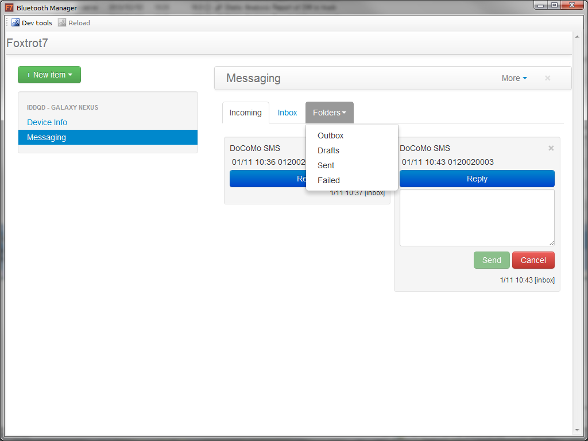
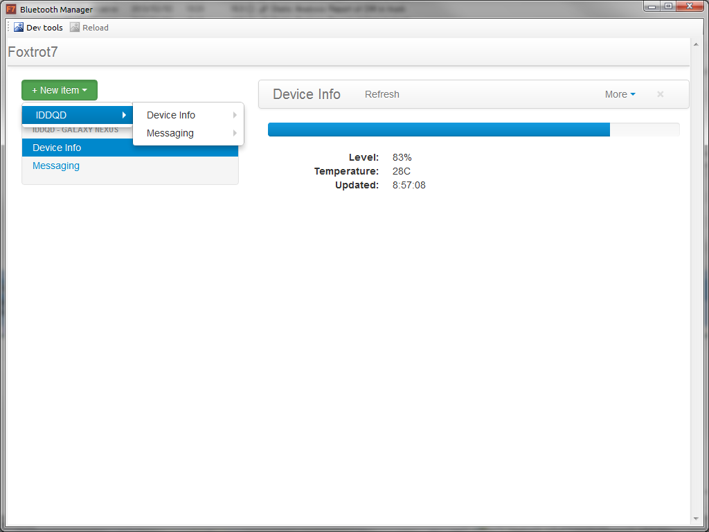

## Foxtrot7 - Communication over Bluetooth library for Desktop and Android

### General Idea
* Give other applications a way to exchange messages using Bluetooth (+WiFi Direct, +Ad-Hoc?)
* Required functionality provided with AIDL interface [Plugin AIDL](Dispatcher/src-aidl/org/kvj/foxtrot7/aidl/F7MessagePlugin.aidl), [Provider AIDL](Dispatcher/src-aidl/org/kvj/foxtrot7/aidl/F7MessageProvider.aidl)
* Connection negotiation, message delivery is hidden from service consumers
* Support Desktop application as well as Android. Desktop plugins are written in Javascript [Plugin stub](BTWebKitTest/BTWebKitTest/client/main.js#L429)

### Android Application
* Has simple configuration UI (links available plugins with paired devices)
* Implements Bluetooth connection dispatcher
  * manages Bluetooth port 
  * transfers messages between plugins and remote clients
* Has two reference plugins
  * DeviceInfo: provides current device battery state
  * Messages: notifies about new text messages, sends outgoing messages, gives access to stored messages

### Desktop Application
* Built with: .Net framework, 32feet.net (bluetooth library), CefSharp (embedded chromium), JSON, jquery, Twitter Bootstrap
* Provides same set of functions as Android application (configuration, bluetooth connection management)
* Has two reference plugins
  * DeviceInfo: shows devices battery status, displays popup notification when state is changed
  * Messages: displays popup when new message arrives, sends outgoing messages, gives access to stored messages

### Screenshots

